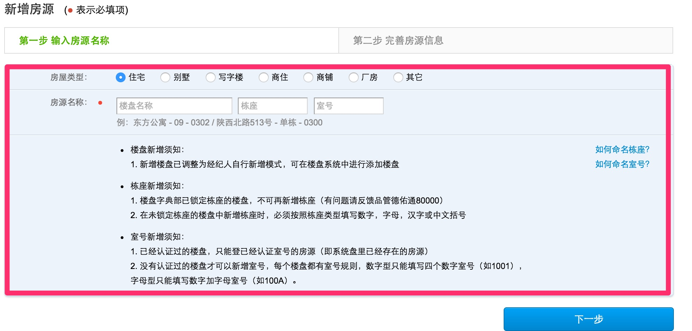
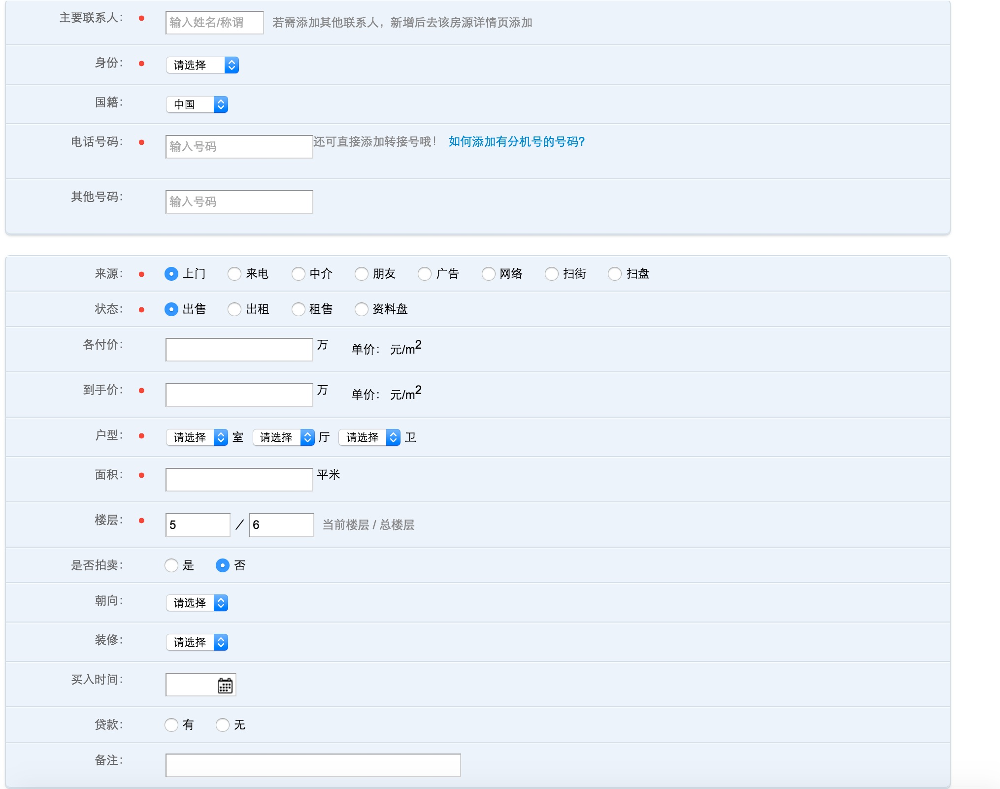
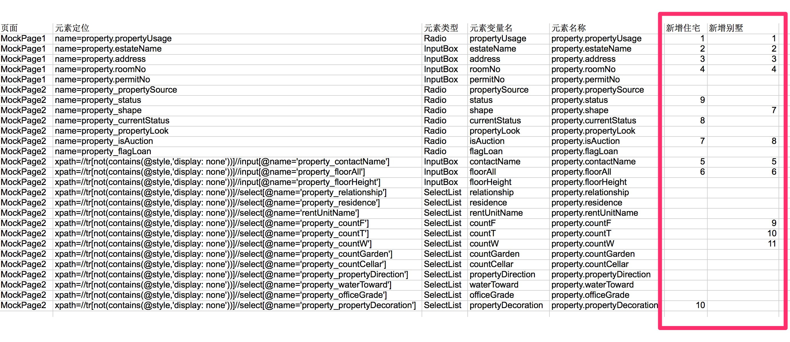
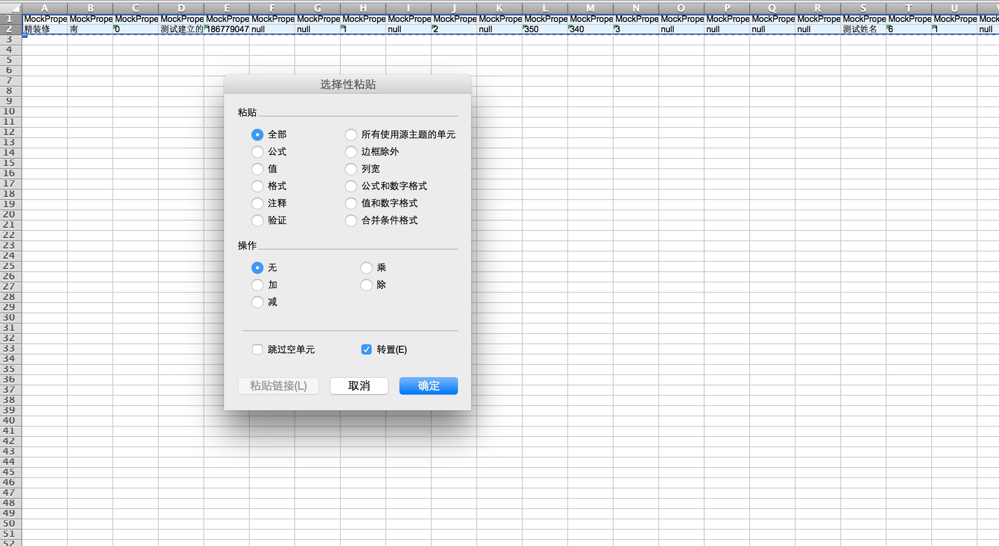
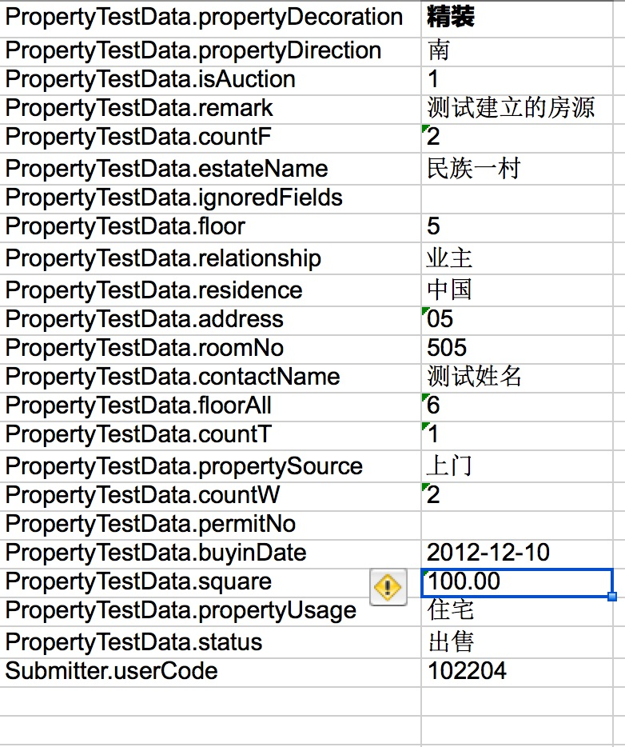

# 0.示例
以下展示一个WebUI测试从头到尾的一个过程：

- 解析页面元素创建PageObject
- 自动生成annotation 或者测试代码
- 测试数据准备
- 测试用例准备
- 测试配置准备
- 编写检查点
- 执行和debug
- 扩展测试数据


## 1. 创建Page Object
Page Object是用来存放被测页面元素说明的一个类，它就是对应了一个被测页面涉及到元素的一个模型，放在一个类里的好处是便于复用和包装，不用把如何查找页面元素的代码散落各处，同时在封装后使用，上层的测试用例级别的代码基本不会和这块再打交道，而是专注于什么样的业务流程。下面是一个使用辅助工具来进行解析页面元素创建Page Object 类的过程的说明。


### 1.1 解析元素器:其实就是一个录制的过程

给页面元素定位非常花费时间，所以录制是一个不错的策略，不同的是这里的工具是解析页面html 源码，来得到我们想要的Page Object 类的格式。这些辅助工具还不能完全你把所有元素都非常好识别，但是还是可以起到一定程度提高效率。
那么为什么自己写一个征用的工具呢？一个原因是没有太好的工具可以非常智能的完成这个任务，另外一个是使用JSOUP这样的工具写一些起到作用的工具不难(当然如果要完全解析正确很难).关于如何解析页面元素会在页面解析说明部分做详细解释.

### 1.2 从添加房源/修改房源这个例子说起:
首先大概描述一下房源的过程：
1. 登陆进入房源首页
2. 点击添加房源后到添加房源页面第一步页面
3. 输入信息信息之后进入房源页面第二步
4. 输入信息之后完成录入房源

这里涉及到比较复杂的页面如下面：


使用一下脚本解析页面元素,source.txt是页面的html源码，可以页面片段也可以是整个页面：

```java

PageObjectParsers poParser = PageObjectParsers.buildFromFilePath("source.txt");
poParser.parse();
```
得到一下结果：
```java
@ElementName(elementName="property.propertyUsage")
private Radio propertyUsage;
@FindBy(name="property.estateName")
@ElementName(elementName = "property.estateName")
private InputBox estateName;
@FindBy(name="property.address")
@ElementName(elementName = "property.address")
private InputBox address;
@FindBy(name="property.roomNo")
@ElementName(elementName = "property.roomNo")
private InputBox roomNo;
@FindBy(name="property.permitNo")
@ElementName(elementName = "property.permitNo")
private InputBox permitNo;
```
这样可以新建一个Page Object 类，将结果放到此类，然后补充没有解析出来的如图中的下一步按钮

接下来的页面如下图：

```java
public class CodeGenerator {
    public static void main(String[] args) {
        WebUICodeGenerator.build().generatePageObjectClass("source.txt");
    }
}
```

得到结果：
```java
@FindBy(name="property_propertySource")
@ElementName(elementName="property.propertySource")
private Radio propertySource;
@FindBy(name="property_status")
@ElementName(elementName="property.status")
private Radio status;
@FindBy(name="property_shape")
@ElementName(elementName="property.shape")
private Radio shape;
@FindBy(name="property_currentStatus")
@ElementName(elementName="property.currentStatus")
private Radio currentStatus;
@FindBy(name="property_propertyLook")
@ElementName(elementName="property.propertyLook")
private Radio propertyLook;
@FindBy(name="property_isAuction")
@ElementName(elementName="property.isAuction")
private Radio isAuction;
@FindBy(name="property_flagLoan")
@ElementName(elementName="property.flagLoan")
private Radio flagLoan;
@FindBy(xpath="//tr[not(contains(@style,'display: none'))]//input[@name='property_contactName']")
@ElementName(elementName="property.contactName")
private InputBox contactName;
@FindBy(xpath="//tr[not(contains(@style,'display: none'))]//input[@name='property_floorAll']")
@ElementName(elementName="property.floorAll")
private InputBox floorAll;
@FindBy(xpath="//tr[not(contains(@style,'display: none'))]//input[@name='property_floorHeight']")
@ElementName(elementName="property.floorHeight")
private InputBox floorHeight;
@FindBy(xpath="//tr[not(contains(@style,'display: none'))]//select[@name='property_relationship']")
@ElementName(elementName="property.relationship")
private SelectList relationship;
@FindBy(xpath="//tr[not(contains(@style,'display: none'))]//select[@name='property_residence']")
@ElementName(elementName="property.residence")
private SelectList residence;
@FindBy(xpath="//tr[not(contains(@style,'display: none'))]//select[@name='rentUnitName']")
@ElementName(elementName="property.rentUnitName")
private SelectList rentUnitName;
@FindBy(xpath="//tr[not(contains(@style,'display: none'))]//select[@name='property_countF']")
@ElementName(elementName="property.countF")
private SelectList countF;
@FindBy(xpath="//tr[not(contains(@style,'display: none'))]//select[@name='property_countT']")
@ElementName(elementName="property.countT")
private SelectList countT;
@FindBy(xpath="//tr[not(contains(@style,'display: none'))]//select[@name='property_countW']")
@ElementName(elementName="property.countW")
private SelectList countW;
@FindBy(xpath="//tr[not(contains(@style,'display: none'))]//select[@name='property_countGarden']")
@ElementName(elementName="property.countGarden")
private SelectList countGarden;
@FindBy(xpath="//tr[not(contains(@style,'display: none'))]//select[@name='property_countCellar']")
@ElementName(elementName="property.countCellar")
private SelectList countCellar;
@FindBy(xpath="//tr[not(contains(@style,'display: none'))]//select[@name='property_propertyDirection']")
@ElementName(elementName="property.propertyDirection")
private SelectList propertyDirection;
@FindBy(xpath="//tr[not(contains(@style,'display: none'))]//select[@name='property_waterToward']")
@ElementName(elementName="property.waterToward")
private SelectList waterToward;
@FindBy(xpath="//tr[not(contains(@style,'display: none'))]//select[@name='property_officeGrade']")
@ElementName(elementName="property.officeGrade")
private SelectList officeGrade;
@FindBy(xpath="//tr[not(contains(@style,'display: none'))]//select[@name='property_propertyDecoration']")
@ElementName(elementName="property.propertyDecoration")
private SelectList propertyDecoration;

```

这个结果已经包含处理html元素绑定相同的model，使用not(contains(@style,'display: none')作为标示了.

至此添加房源中主要的页面元素已经解析成功，再手工补充一些元素就完成了整个Page Objectd构建。

## 2. 自动生成annotation 或者测试代码
当整个业务流程涉及的页面完成后，使用如下的代码生成一份excel:
```java
 WebUICodeGenerator.build().writePageObjectsToExcel("AddProperty.xls",Lists.newArrayList(MockPage1.class,MockPage2.class));
```

这样会生成一个excel文件：


### 2.1 编辑excel，构建被测的业务流程
假设你需要完成新增住宅和别墅两个业务，那么编辑excel，指定这两个业务的流程需要操作的顺序，如下图：


### 2.2 注解方式:
生成注解代码，其中新增住宅，新增别墅就是excel中表示的流程名字

```java
 WebUICodeGenerator t=  WebUICodeGenerator.build("AddProperty.xls");
                t.generateAnnotationStatement("新增住宅");
        t.generateAnnotationStatement("新增别墅");
```

得到注解
```java
MockPage1:
@UIActions(actions={@UIAction(processName="新增住宅",elementActionDescription={"propertyUsage","estateName","address","roomNo"})
})
MockPage2:
@UIActions(actions={@UIAction(processName="新增住宅",elementActionDescription={"contactName","floorAll","isAuction","currentStatus","status","propertyDecoration"})
})
MockPage1:
@UIActions(actions={@UIAction(processName="新增别墅",elementActionDescription={"propertyUsage","estateName","address","roomNo"})
})
MockPage2:
@UIActions(actions={@UIAction(processName="新增别墅",elementActionDescription={"contactName","floorAll","shape","isAuction","countF","countT","countW"})
})
```

将不同的注解复制到不同的Page Object类中


最后构建整个业务流程，使用如下代码：中文命名只是为了说明使用。
```java
public class 新增住宅 extends BaseWebTestAction {

    public 新增住宅(WebDriver driver, TestData testData) {
        super(driver, testData);
    }

    @Override
    public void execute() {
        WebTestActionBuilder.createTestActionByUIAction(MockPage1.class, "新增住宅",driver, testData).execute();
        WebTestActionBuilder.createTestActionByUIAction(MockPage2.class, "新增住宅",driver, testData).execute();
    }
}
```

以上代码中execute()实质上等价：
```java
   MockPage1 page1 = ModifiedPageFactory.createPageObject(driver,MockPage1.class);
        page1.processUIAction("新增住宅",testData);
        MockPage2 page2 = ModifiedPageFactory.createPageObject(driver,MockPage2.class);
        page2.processUIAction("新增住宅",testData);
```
以及：

```java
   MockPage1 page1 = ModifiedPageFactory.createPageObject(driver,MockPage1.class);
        page1.getPropertyUsage().selectByVisibleText(testData.get("propertyUsage"));
        page1.getAddress().input(testData.get("address"));
        page1.getEstateName().input(testData.get("estateName"));
        page1.getRoomNo().input(testData.get("roomNo"));
        MockPage2 page2 = ModifiedPageFactory.createPageObject(driver,MockPage2.class);
        page2.getContactName().input(testData.get("contractName"));
        ...........
```

###2.3 直接生成代码：
使用代码：
```java
WebUICodeGenerator t=  WebUICodeGenerator.build("AddProperty.xls");
        t.generateSingleTestStep("新增住宅");
        t.generateSingleTestStep("新增别墅");
```

生成的测试代码：
```java
public static void 新增住宅(WebDriver driver,TestData testData){
WebTestActionBuilder.createTestActionByElementActionList(MockPage1.class,Lists.newArrayList("propertyUsage","estateName","address","roomNo"),driver,testData).execute();
WebTestActionBuilder.createTestActionByElementActionList(MockPage2.class,Lists.newArrayList("contactName","floorAll","isAuction","currentStatus","status","propertyDecoration"),driver,testData).execute();
}
public static void 新增别墅(WebDriver driver,TestData testData){
WebTestActionBuilder.createTestActionByElementActionList(MockPage1.class,Lists.newArrayList("propertyUsage","estateName","address","roomNo"),driver,testData).execute();
WebTestActionBuilder.createTestActionByElementActionList(MockPage2.class,Lists.newArrayList("contactName","floorAll","shape","isAuction","countF","countT","countW"),driver,testData).execute();
}
```

然后可以将这些代码到一个将类似功能的都放在一起的类，如下例：
```java
public class PropertyFlows {

    public static void 修改建造年代(WebDriver driver, TestData testData) {
        handleFY(driver, testData);
        WebTestActionBuilder.createTestActionByElementActionList(PropertyPage.class,
                Lists.newArrayList("completeYear", "edit"), driver, testData).execute();
        WebTestActionBuilder.createTestActionByElementActionList(ChangeCompleteYearPage.class,
                Lists.newArrayList("completeYear", "submit"), driver, testData).execute();
    }

    private static void handleFY(WebDriver driver, TestData testData) {
        driver.get(EnvironmentHelper.getDomainUrl() + "/property/" + testData.get("propertyId"));
        WebTestActionBuilder.createTestActionByElementActionList(PropertyPage.class,
                Lists.newArrayList("handleFY"), driver, testData).execute();
        driver.get(EnvironmentHelper.getDomainUrl() + "/property/" + testData.get("propertyId"));
    }

    public static void 修改朝向(WebDriver driver, TestData testData) {
        handleFY(driver, testData);
        WebTestActionBuilder.createTestActionByElementActionList(PropertyPage.class, Lists.newArrayList("propertyDirection", "edit"), driver, testData).execute();
        WebTestActionBuilder.createTestActionByElementActionList(ChangePropertyDirectionPage.class, Lists.newArrayList("propertyDirection", "submit"), driver, testData).execute();
    }

    public static void 修改装修(WebDriver driver, TestData testData) {
        handleFY(driver, testData);
        WebTestActionBuilder.createTestActionByElementActionList(PropertyPage.class, Lists.newArrayList("propertyDecoration", "edit"), driver, testData).execute();
        WebTestActionBuilder.createTestActionByElementActionList(ChangePropertyDecorationPage.class, Lists.newArrayList("propertyDecoration", "devices", "submit"), driver, testData).execute();
    }

    public static void 修改买入时间(WebDriver driver, TestData testData) {
        handleFY(driver, testData);
        WebTestActionBuilder.createTestActionByElementActionList(PropertyPage.class, Lists.newArrayList("buyinDate", "edit"), driver, testData).execute();
        WebTestActionBuilder.createTestActionByElementActionList(ChangePropertyBuyInDatePage.class, Lists.newArrayList("buyinDate", "submit", "isFiveYears"), driver, testData).execute();
    }

    public static void 修改买入价格(WebDriver driver, TestData testData) {
        handleFY(driver, testData);
        WebTestActionBuilder.createTestActionByElementActionList(PropertyPage.class, Lists.newArrayList("billPrice", "edit"), driver, testData).execute();
        WebTestActionBuilder.
                createTestActionByElementActionList(
                        ChangePropertyBuyInPricePage.class,
                        Lists.newArrayList("price", "pricePrecise", "submit"),
                        driver, testData).execute();
    }


    public static void 修改备注(WebDriver driver, TestData testData) {
        handleFY(driver, testData);
        WebTestActionBuilder.createTestActionByElementActionList(PropertyPage.class, Lists.newArrayList("remark", "edit"), driver, testData).execute();
        WebTestActionBuilder.createTestActionByElementActionList(ChangePropertyCommentsPage.class, Lists.newArrayList("remark", "submit"), driver, testData).execute();
    }

    public static void 修改楼层(WebDriver driver, TestData testData) {
        handleFY(driver, testData);
        WebTestActionBuilder.createTestActionByElementActionList(PropertyPage.class, Lists.newArrayList("floor", "edit"), driver, testData).execute();
        WebTestActionBuilder.createTestActionByElementActionList(ChangePropertyFloorsPage.class, Lists.newArrayList("floor", "floorAll", "submit"), driver, testData).execute();
    }

    public static void 修改是否唯一(WebDriver driver, TestData testData) {
        handleFY(driver, testData);
        WebTestActionBuilder.createTestActionByElementActionList(PropertyPage.class, Lists.newArrayList("isOnlyOne", "edit"), driver, testData).execute();
        WebTestActionBuilder.createTestActionByElementActionList(ChangePropertyIsOnlyPage.class, Lists.newArrayList("isOnlyOne", "submit"), driver, testData).execute();
    }

    public static void 修改户型(WebDriver driver, TestData testData) {
        handleFY(driver, testData);
        WebTestActionBuilder.createTestActionByElementActionList(PropertyPage.class, Lists.newArrayList("roomLayout", "edit"), driver, testData).execute();
        WebTestActionBuilder.createTestActionByElementActionList(ChangePropertyLayoutPage.class, Lists.newArrayList("countY", "countW", "countT", "countF", "submit"), driver, testData).execute();
    }

    public static void 修改贷款信息(WebDriver driver, TestData testData) {
        handleFY(driver, testData);
        WebTestActionBuilder.createTestActionByElementActionList(PropertyPage.class, Lists.newArrayList("propertyLoan", "edit"), driver, testData).execute();
        WebTestActionBuilder.createTestActionByElementActionList(ChangePropertyLoanInfoPage.class, Lists.newArrayList("propertyLoanTotalPrice", "propertyLoanBeginTime"
                , "propertyLoanEndTime", "propertyLoanPriceUnit", "submit"), driver, testData).execute();
    }

    public static void 修改车位信息(WebDriver driver, TestData testData) {
        handleFY(driver, testData);
        WebTestActionBuilder.createTestActionByElementActionList(PropertyPage.class, Lists.newArrayList("parking"
                , "edit"), driver, testData).execute();
        WebTestActionBuilder.createTestActionByElementActionList(ChangePropertyParkingPage.class,
                Lists.newArrayList("parking", "countGarage",
                        "countParks", "parkingSquare",
                        "parkingNumber", "parkingAddress","parkingRemark","submit"), driver, testData).execute();
    }

    public static void 修改价格(WebDriver driver,TestData testData){
        handleFY(driver, testData);
        WebTestActionBuilder.createTestActionByElementActionList(PropertyPage.class,Lists.newArrayList("price","edit"),driver,testData).execute();
        WebTestActionBuilder.createTestActionByElementActionList(ChangePropertyPricePage.class,Lists.newArrayList("price",
                "handPrice","priceMemo","submit"),driver,testData).execute();
    }
}
```

## 3. 测试数据准备
测试离不开测试数据的准备，测试数据类可以直接页面Page Object来生成：

```java
 WebUICodeGenerator t=  WebUICodeGenerator.build();
        t.generateTestDataClass(Lists.newArrayList(MockPage1.class,MockPage2.class));
```
结果：
```java
private String propertyUsage;
private String estateName;
private String address;
private String roomNo;
private String permitNo;
private String propertySource;
private String status;
private String shape;
private String currentStatus;
private String propertyLook;
private String isAuction;
private String flagLoan;
private String contactName;
private String floorAll;
private String floorHeight;
private String relationship;
private String residence;
private String rentUnitName;
private String countF;
private String countT;
private String countW;
private String countGarden;
private String countCellar;
private String propertyDirection;
private String waterToward;
private String officeGrade;
private String propertyDecoration;
```

创建完测试数据类之后可以据此生成excel:
```java
new MockPropertyData().toXLS("addProperty","addProperty.xls");
```
生成的excel如下图,使用选择性粘贴转置，可以将行数据转成列数据：


## 4.测试用例准备

编写测试时用例,格式如下例，以下是几点说明:
- data provider 块指定了需要的测试数据，以及他和测试数据类的对应关系
- Test下面就是实际的测试流程
- 登陆已经写到公用模块，不同业务都可以直接调用
- AddPropertyFlow 就是刚才生成的业务流程代码的类或者函数

```java
public class AddPropertyFlowTest extends BaseWebTest {

    @DataProvider(name = "property_data")
    public Iterator<Object[]> getAPITestData(Method m) throws Exception{
        Map<String, Class> clazzMap = new HashMap<String, Class>();
        clazzMap.put("PropertyTestData", PropertyTestData.class);
        clazzMap.put("Submitter", EmployeeTestData.class);
        Iterator<Object[]> y = ExcelHelper.build("testcase/flows/addPropertyTestCases.xls").ToIteratorInColMode(clazzMap);
        return y;
    }

    @Test(dataProvider ="property_data" )
    public void addProperty(PropertyTestData testData,EmployeeTestData submitter) throws InterruptedException {
        String password=******LoginHelper.getIntegrationLoginPassword("110863", "PW_123456");
        System.out.println(password);
        submitter.setPassword(password);
        ******LoginHelper.login(submitter.getUserCode(), submitter.getPassword(), driver);
        AddPropertyFlow flow = new AddPropertyFlow(driver,testData);
        flow.execute();
    }

}
```

## 5.测试配置准备

测试配置的Property，都放在env.properties 文件中，详细的内容参考注释：
```
# 测试环境配置
test.fangyuan.jdbc.url= jdbc:sqlserver://10.8.1.***:1433;DatabaseName=****;sendStringParameterAsUnicode=false
test.fangyuan.jdbc.driver = com.microsoft.sqlserver.jdbc.SQLServerDriver
test.fangyuan.jdbc.username=******admin
test.fangyuan.jdbc.password=******
# API测试域名
test.fangyuan.service.root=http://open.******.org
# Open API 测试的域名
test.openapi.root=http://open.******.org
# 测试主页的URL
test.home.url=http://blog.******.org
# 不同应用的主入口URL
test.domain.url =http://fy.******.org

# 集成环境配置
integration.fangyuan.jdbc.url= jdbc:sqlserver://192.168.3.**:1433;DatabaseName=****;sendStringParameterAsUnicode=false
integration.fangyuan.jdbc.driver = com.microsoft.sqlserver.jdbc.SQLServerDriver
integration.fangyuan.jdbc.username=******
integration.fangyuan.jdbc.password= *****
integration.service.root=http://open.******.org
# Open API 测试的域名
integration.openapi.root=http://open.******.org
# 测试主页的URL
integration.home.url=http://blog.******.org
# 不同应用的主入口URL
integration.domain.url =http://fy.******.org
# 指定当前测试环境是集成还是测试
target.environment = integration
# 默认的应用名称，主要用来对应数据库
default.appname=fangyuan
# 测试跑的当前系统，默认(不填)是windows
test_platform=macos

# webdriver 设置
# driverconfiguration.chrome.path =
# driverconfiguration.eventlistener =
# driverconfiguration.browsetype=chrome
# driverconfiguration.webdrivermode=local
# driverconfiguration.gridurl= http://localhost:8080:4400

# 是否把API response写到文件，默认不写，配置之后可以写
# write_api_response =true

# default_chromedriver_location=C:\autotest\chromedriver.exe

## Application configuration
# open API访问使用的token
grant_type=client_credential
client_id=***************
client_secret=**************
```
## 6. 编写检查点
编写检查点可以如下例：
- 前面表示页面元素的检查
- 后面表示和数据库的比较

```java

SoftAssertion sa = new SoftAssertion();
String result = driver.findElement(By.xpath(String.format("//tr[@field_name='%s']//td[2]",fieldName))).getText().trim();
sa.assertTrue(result.contains(testData.get(fieldName)), reasons);
storedDate = SpringJdbcTemplateUtils.DEFAULT().getStringValue(String.format("select * from property where propertyId='%s'"
                    ,testData.getPropertyId()),fieldName);
sa.assertTrue(storedDate.contains(testData.get(fieldName)), reasons);
```
## 7. 添加新的测试数据
整个测试是数据驱动的，所以输入不同的数据就代表不同的测试用例，所以在excel中添加不同的数据，由于测试数据类中变量名是和page object类里面的变量名是一样的，所以excel中给某个变量的值，就会直接在操作页面元素时作为页面元素的输入，下面是一个数据的例子：


## 8. 执行和debug

如果一切顺利的话测试就可以跑起来了


## 9. 一些参考的例子：

房源: automation-fangyuan 下面：ChangePropertyTest,AddPropertyTest,PropertyFlows,AddPropertyFlow


